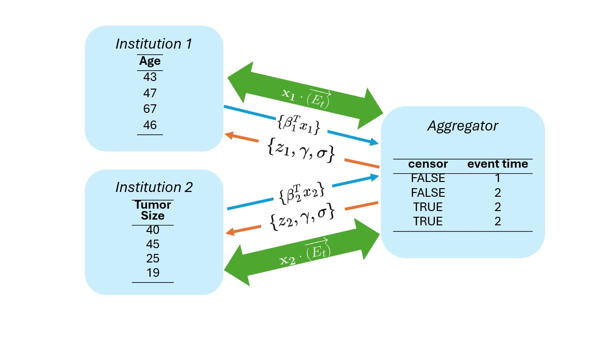

# Security risks

It is important to be transparent about the security risks associated with using Verticox+. The
following points should be considered:

## Record level aggregations
While verticox+ does not share raw data with other parties. It does share record level aggregations,
feature nodes do share record-level aggregations of feature data. Figure 1 shows how parties 
exchange data between eachother. It is important to note that institution 1 and 2 (the feature 
nodes) send \( \beta_k^T x_{k} \) to the aggregator. In this case \(\beta_k\) refers to the 
coefficients for the covariates that are present on feature node k. More importantly, \(x_{k}\) 
refers to the raw values for the features at institution \( k \). Therefore, \( \beta_k^T x_{k} 
\) is a vector that has an aggregation of the features for every sample at institution \( k \), 
based on the current value of the covariates.

/// caption
Figure 1: Overview of data exchange between parties
///

## Node-to-node communication in vantage6
This algorithm makes use of the node-to-node communication in vantage6, as it was available in 
version 4.7.1. This provides a direct channel of communication between nodes based on VPN. This 
means that a vpn server provides a separate channel of communication between nodes. The setup of 
this VPN is described in the [eduvpn section of the vantage6 documentation](https://docs.vantage6.
ai/en/main/server/optional.html#eduvpn). The implementation of this solution in your 
infrastructure needs to be thoroughly reviewed.